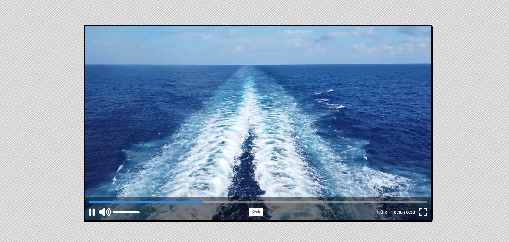
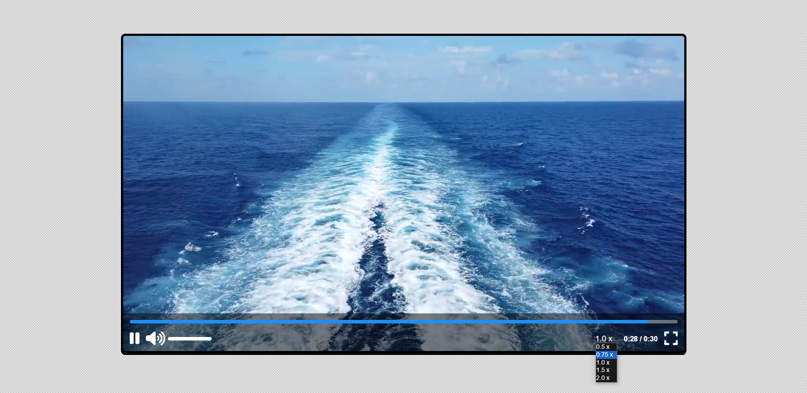

🎥 Custom Video Player
A custom video player web application developed with HTML, CSS and JavaScript.

📸 Screenshots

🚀 Technologies Used
HTML5: Web page structure and the <video> tag to display and control video.
CSS3: Styling the interface and creating a responsive design.
JavaScript: Programming interactive functionality and video player logic.

📽 Main Features
Play and pause.
Progress bar for video navigation.
Volume control with move option.
Setting the video playback speed.
Display elapsed time and video duration.
Option for fullscreen mode.

📘 ZTM Academy project
This custom video player is part of ZTM Academy's "JavaScript Web Projects: 20 Projects to Build Your Portfolio" course, representing a practical implementation of the concepts learned in this course.
